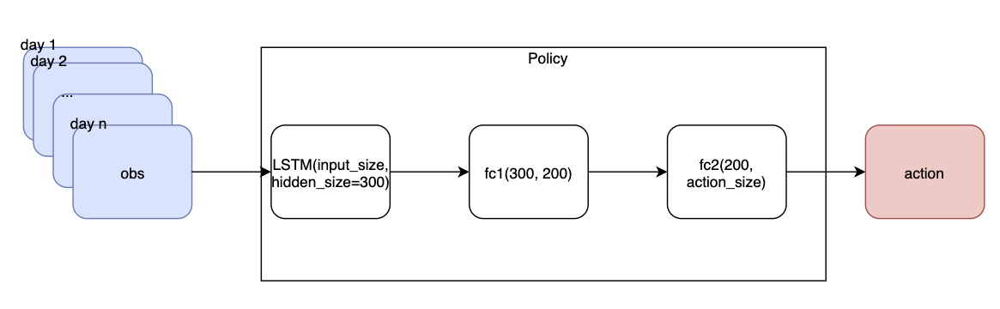
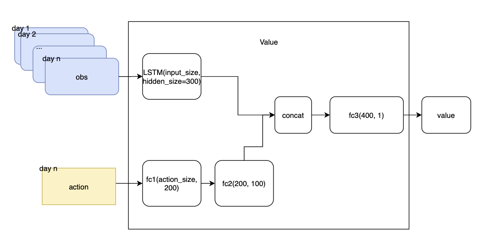

[](https://badge.fury.io/py/tbase)
[](https://coveralls.io/github/tradingAI/tbase?branch=master) [](https://gitter.im/tradingAI/tbase?utm_source=badge&utm_medium=badge&utm_campaign=pr-badge&utm_content=badge)
# tbase

基于强化学习的交易算法Baselines(Pytorch实现). 旨在提供一个在中国股市上可复现的算法Baselines.

支持环境： Python 3.5–3.7

# 安装

设置 tushare token[(Tushare token注册申请)](https://tushare.pro/register?reg=124861):

```
export TUSHARE_TOKEN=YOUR_TOKEN
```

**1\. Mac OSX/Ubuntu**
- **安装方式一(直接使用):** `pip install tbase>=0.1.6`
- **安装方式二(开发者模式)**
  ```
  git clone https://github.com/tradingAI/tbase
  cd tbase
  pip install -e .
  ```

**2\. Docker**

- 1. [docker install](https://docs.docker.com/install/)
- 2. `export TUSHARE_TOKEN=YOUR_TOKEN`
- 3. 构建image的方式
  - Build your docker image: `bash build-docker-image.sh`,
  - [docker hub](https://hub.docker.com/repository/docker/tradingai/tbase): `docker pull tradingai/tbase:latest`
  - [阿里云镜像](https://cr.console.aliyun.com/repository/cn-hangzhou/tradingai/tbase/images): `docker pull registry.cn-hangzhou.aliyuncs.com/tradingai/tbase:latest`
- 4. 手动运行(Note: 如果使用阿里云镜像，需要更改镜像名称)
  - CPU版本
    ```
    docker run -it \
        -e TUSHARE_TOKEN=$TUSHARE_TOKEN \
        -v $PWD:/root/trade/tbase \
        tradingai/tbase:latest bash
    ```
  - GPU版本
    ```
    docker run --runtime=nvidia -it \
        -e TUSHARE_TOKEN=$TUSHARE_TOKEN \
        -v $PWD:/root/trade/tbase \
        tradingai/tbase:gpu-latest bash
    ```
  - `python -m tbase.run --alg ddpg --codes 000001.SZ --seed 0`


# Features(In progress)
- [x] 可以完美复现训练过程, [How?](docs/reproducible.md)
- [ ] 加速

  - [x] 多进程CPU并行: 多进程运行独立的Enviroment进行探索
  - [x] 多进程单GPU并行
  - [ ] 多进程多GPU并行
  - [ ] 混合精度训练(Apex)
  - [ ] 分布式多机多卡并行(基于[Horovod](https://github.com/horovod/horovod))

- [x] 通过运行参数选择:

  - [x] 环境
  - [x] 算法
  - [x] Policy-Net
  - [x] Value-Net

- 支持RL算法:

  - [ ] 单Agent

    - [x] DDPG
    - [x] TD3(Twin Delayed Deep Deterministic Policy Gradients)
    - [ ] A2C-ACKTR
      - [x] A2C
      - [ ] ACKTR
    - [ ] PPO
    - [ ] PPO2
    - [ ] GAIL

  - [ ] 多Agent

    - [ ] MADDPG

- 自定义Net

  - [x] LSTM-MLP
  - [x] LSTM_Merge_MLP
  - [ ] MLP
  - [ ] LSTM
  - [ ] CNN
  - [ ] CNN-MLP

# 训练

例如 ddpg

```
python3 -m tbase.run --alg ddpg --num_env 1 --gamma 0.53 --seed 9 --print_action
```

默认参数:
- scenario: "average", 平均分仓操作
- codes: "000001.SZ", 平安银行
- indexs: "000001.SH,399001.SZ", [000001.SH:沪指, 399001.SZ: 深指](https://tushare.pro/document/2?doc_id=94)
- start: "20190101", 训练开始时间
- end: "201901231", 训练结束时间
- max_iter_num: "500", 训练轮数
- num_env: "1", 并行进程数, 当`num_env=1`时，不使用多进程方式运行
- seed: "None", 系统随机种子
- print_action: "False", 随机打印action的值，方便查看action分布状况
- reward_fn: "daily_return_with_chl_penalty", env reward function
- run_id: "1", 运行序号, 方便查看相同参数多次运行结果差异
- debug: "False", debug模式，打印具体的交易信息
- eval: "False", 回测评估，为True时，不训练，只加载模型进行回测
- [其他参数](tbase/common/cmd_util.py)


**Defalut policy net setting(actor)**



**Defalut value net setting(critic)**



运行tensorboard

`tensorboard --logdir=/tmp/tbase/tensorboard`

可以在[http://localhost:6006](http://localhost:6006/)中查看训练的loss, reward ,portfolio, time等指标


# 加载模型

# 评估&&回测

- [x] 训练周期内的评估指标
- [x] 回测: 模型在训练周期外(评估周期)的评估指标
  ```
  # lookback=10， 若测试从20200101开始, 则eval_start往前推10个交易日
  python -m tbase.run --alg ddpg --eval --eval_start 20191218 --eval_end 20200223 --seed 9
  ```
- [ ] 滑动窗口更新模型, 在评估周期内，每隔一个窗口T，重新训练一次模型，当T>评估周期时，等价于固定模型

## 评估指标

- [x] 绝对收益率(Absolute Return)
- [ ] 额外收益率(Excess Return)

  - [x] 相对于"买入持有"策略
  - [ ] 相对于基线策略比如"沪深300"

- [x] 最大回撤: 在选定周期内任一历史时点往后推，净值走到最低点时的收益率回撤幅度的最大值

- [x] 夏普比率: 投资组合每承受一单位总风险，会产生多少的超额报酬

- [x] 年化收益率

## Contribution
- Fork this repo
- Add or change code && **Please add tests for changes**
- Test
  - step1. 设置[docker-compose](docker-compose.yml)需要的环境变量: BAZEL_USER_ROOT, OUTPUT_DIR, TUSHARE_TOKEN
  - step2. `docker-compose up`
- Send pull request

# 如何增加agent
1. Fork  https://github.com/tradingAI/tbase
2. 在tbase.agents下添加目录, 例如: ddpg
3. 新建agent.py, 在类名为Agent的类中实现你的agent(继承tbase.common.base_agent.BaseAgent)
4. **添加单元测试**
  - step1. 设置[docker-compose](docker-compose.yml)需要的环境变量: BAZEL_USER_ROOT, OUTPUT_DIR, TUSHARE_TOKEN
  - step2. `docker-compose up`
5. 发起pull request

# 待优化

- [x] [bazel build](https://bazel.build/)
- [x] 版本管理
- [x] Github Actions CI
- [ ] 测试: 提升 unit test 覆盖率([coveralls.io](https://coveralls.io/))
- [ ] Blog Post && baseline模型共享(百度网盘)
- [ ] 模型分享，评估，部署: [tweb](http://tweb.aiminders.com/)[guest:guest], [tweb repo](https://github.com/tradingAI/tweb)
  - 提供web上传方式，模型榜单排名
  - commit id
  - 训练的运行参数
  - 评估的运行参数: codes, start, end
  - performance: 参考评估指标(去除绝对收益率)
  - 模型的百度云盘链接
- [ ] Experiments Tracking: [MLflow Tracking](https://mlflow.org/docs/latest/tracking.html#mlflow-tracking)

**由于计算资源有限，为所有的算法跑完A股中所有的股票，需要花费大量的时间，希望有空闲计算资源的朋友，可以跑一下模型，将实验结果分享出来**

线上交流方式

- QQ群: 477860214
