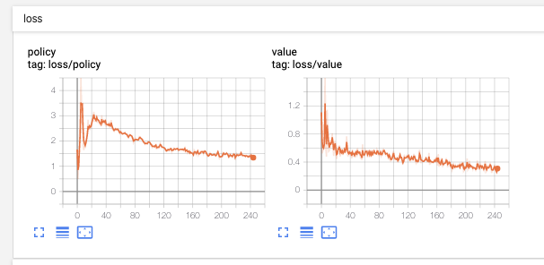
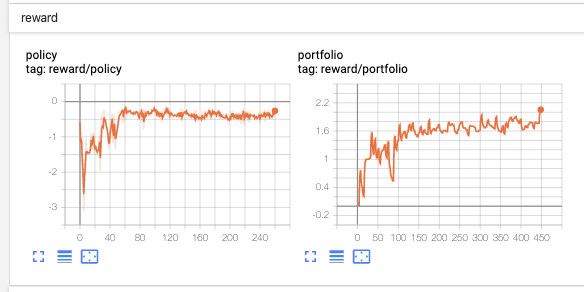

# tbase

Baselines of trade agents use reinforcement learning algorithms(PyTorch).

支持环境： python3(>=3.5)

# 安装

设置 tushare token[(token注册链接:https://tushare.pro/register?reg=124861)](https://tushare.pro/register?reg=124861):

```
export TUSHARE_TOKEN=YOUR_TOKEN
```

## Docker Image

1. [docker install](https://docs.docker.com/install/)
2. `bash build.sh`

## Local

安装步骤参考: [Ubuntu 18.04 Dockerfile](Dockerfile)

# Features(开发中, 欢迎一起完善)

- [ ] 加速

  - [x] 多进程CPU并行: 多进程运行独立的Enviroment进行探索
  - [ ] 多进程单GPU并行
  - [ ] 多进程多GPU并行

- [ ] 支持单Agent与多Agent, 例如: MADDPG

- [x] 通过运行参数选择:

  - [x] 环境
  - [x] 算法
  - [x] Policy-Net
  - [x] Value-Net

- 支持RL算法:

  - [ ] One Agent

    - [x] DDPG
    - [ ] Dueling DDPG
    - [ ] A2C
    - [ ] PPO
    - [ ] PPO2
    - [ ] ACKTR
    - [ ] GAIL
    - [ ] TD3

  - [ ] Multi-Agent

    - [ ] MADDPG

- 自定义Net

  - [x] LSTM-MLP
  - [x] LSTM_Merge_MLP
  - [ ] MLP
  - [ ] LSTM
  - [ ] CNN
  - [ ] CNN-MLP

# 训练

例如 ddpg 默认参数:

- codes: "000001.SZ", 平安银行
- indexs: "000001.SH,399001.SZ", [000001.SH:沪指, 399001.SZ: 深指](https://tushare.pro/document/2?doc_id=94)
- start: "20190101", 训练开始时间
- end: "201901231", 训练结束时间
- max_iter_num: "100", 训练轮数
- num_env: "2"， 并行进程数
- [其他参数](tbase/common/cmd_util.py)

```
python3 -m tbase.run --alg ddpg --num_env 4 --gamma 0.5 --max_iter_num 500
```

运行tensorboard

`tensorboard --logdir=/tmp/tbase/tensorboard`

可以在[http://localhost:6006](http://localhost:6006/)中查看训练的loss, reward ,portfolio, time等指标



# 加载模型

# 评估

- [x] 训练周期内的评估指标
- [ ] 模型随未来时间推移的性能指标
- [ ] 滑动窗口更新模型, 在评估周期内，每隔一个窗口T，重新训练一次模型，当T>评估周期时，等价于固定模型

## 评估指标

- [x] 绝对收益率(Absolute Return)
- [ ] 额外收益率(Excess Return)

  - [ ] 相对于"买入持有"策略
  - [ ] 相对于基线策略比如"上证300"

- [ ] 最大回撤: 在选定周期内任一历史时点往后推，产品净值走到最低点时的收益率回撤幅度的最大值

- [ ] 夏普比率: 投资组合每承受一单位总风险，会产生多少的超额报酬
