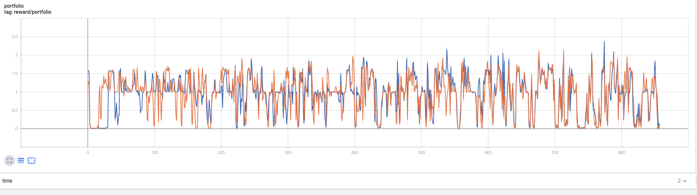

# TD3

- Original paper: <https://arxiv.org/pdf/1802.09477.pdf>
- Baselines post: TODO
- `python3 -m tbase.run --alg=td3 --scenario=average --max_iter_num=500 --seed 9` runs the algorithm for about 122000 days = 500 episode on a tgym.average environment. See help (`-h`) for more options.

**Note**
Repo中的实现与论文中探索部分不太一样， 具体的改动请参考源代码

# Portfolio: td3 vs ddpg

